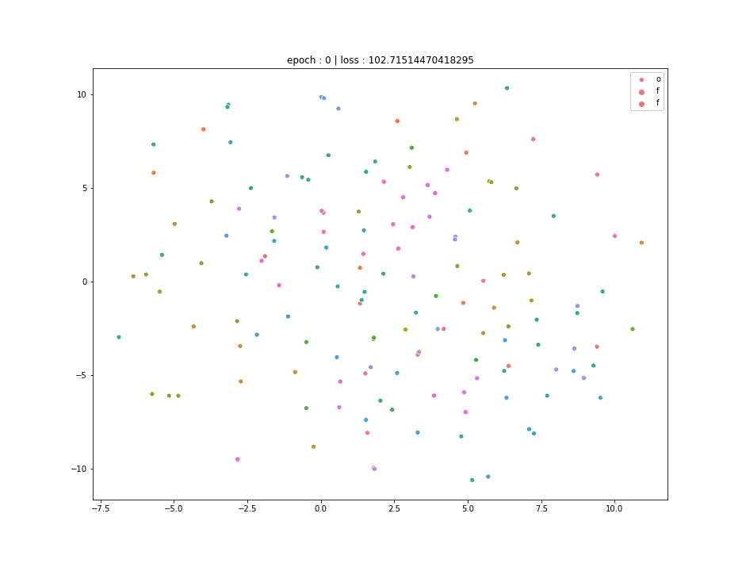
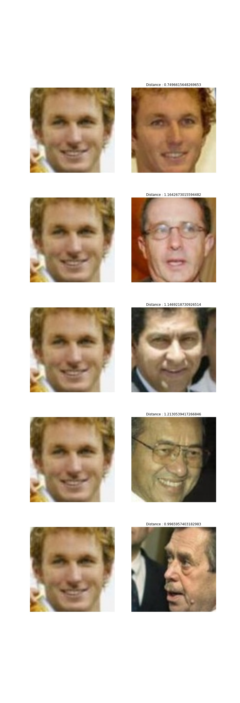

### Face Varification, Clustering and Recognition Tasks Using FaceNet And Triplet Loss

**This is a simpler and intuative implementation for the original facenet paper by Google ( https://arxiv.org/abs/1503.03832 ).**

    In traditional methods we try to train our model to recognize faces as categories using deep neural nets and minimizes the losses using Softmax and Crossentropy functions but it can get pretty messy at large scale datasets, so this paper introduces a system calles FaceNet, that directly learns a mapping from face images to a compact Euclidean space where distances directly correspond to a measure of face similarity.

    Once this space has been produced, tasks such as face recognition, verification and clustering can be easily implemented using standard techniques with FaceNet embeddings as feature vectors.

    The network takes an image as input and outputs a N-Dimensional Vector (in this implementation 110x110x3 image and 128-D vector) which are used as embeddings for the given image. 

    

    This paper proposes concept of triplet loss. To understand the loss function let's take an example of three images, where two images are of a same person where one is called as anchor and the other one is calles as positive and a third one is of a different person which is reffered as negative. Objective of this function to reduce the distance between output of anchor and positive image and increase the distance between output of anchor image and negative image.

    

#### I used custom deep neural network to produce embeddings you can use your own network and customize the number of dimensions as you require. 

### Training on 50 Faces Mini Batch

> Training Process

> After 15 epochs.

> Testing On Face Images

#### Citations

    LFW funneled images
    @InProceedings{Huang2007a,
        author =    {Gary B. Huang and Vidit Jain and Erik Learned-Miller},
        title =     {Unsupervised Joint Alignment of Complex Images},
        booktitle = {ICCV},
        year =      {2007}
    }

    @INPROCEEDINGS{7298682,
        author={F. {Schroff} and D. {Kalenichenko} and J. {Philbin}},
        booktitle={2015 IEEE Conference on Computer Vision and Pattern Recognition (CVPR)}, 
        title={FaceNet: A unified embedding for face recognition and clustering}, 
        year={2015},
        volume={},
        number={},
        pages={815-823},
    }